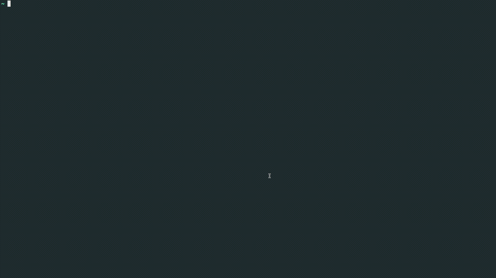

# venv-manager



## Install

```sh
curl -s https://raw.githubusercontent.com/rrossmiller/venv-manager/main/scripts/install_rs.sh | /bin/zsh
```

The installer adds a `venv` shell function to `~/.zshrc` or `~/.bashrc`. To add it manually, use:

```sh
function venv() {
    ~/.venvs/bin/venv_manager "$@"
    if [[ $? -eq 0 ]]; then
        eval "$(tail -n 1 ~/.venvs/.history)"
    fi
}

# Load dynamic completions for Bash or Zsh.
source <(COMPLETE="${SHELL##*/}" ~/.venvs/bin/venv_manager)
```

Then reload your shell:

```sh
source ~/.zshrc # or ~/.bashrc
venv
```

## Usage

```sh
venv list
venv create my-project 3.12
venv activate my-project
venv delete my-project
venv my-project
```

Running `venv` with no arguments opens the interactive picker.

## Tab completion

The installer enables dynamic completion for Bash and Zsh. Type `venv <tab>`
to complete an environment name or subcommand. Environment names are also
completed after `venv activate` and `venv delete`.

Completions are read from `~/.venvs` each time, so newly created or deleted
environments appear immediately. Shells that support completion descriptions
also show the Python version from `pyvenv.cfg` and the environment's path.

To enable completion manually in the current shell:

```sh
source <(COMPLETE="${SHELL##*/}" ~/.venvs/bin/venv_manager)
```
